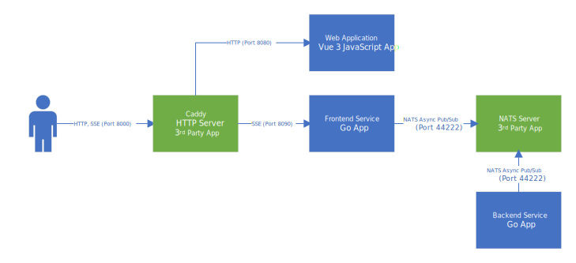
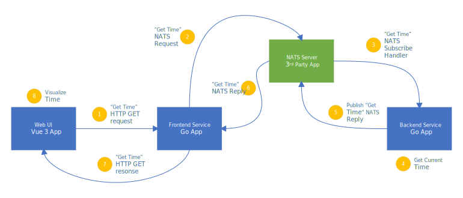
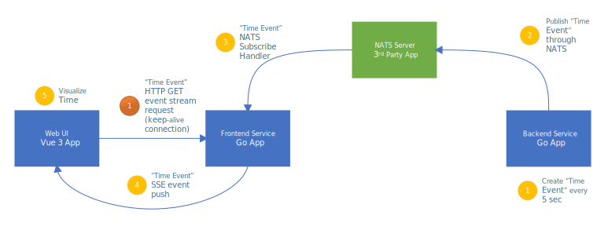

# Show case for cloud UI application

This example describes very simple application which shows backed time and updates it every 5 second. 

Multiple UI applications could be connected simultaneously. Ensure that you are not hitting SSE limit (6 connections accross all the tabs).


###### Technology stack:

* Go languge based services for frontend and backend

* JavaScript Vue 3 based UI application

* NATS message bus

###### Protocols

* HTTP/HTTPS REST like protocol between Web UI and Frontend Service
  
  * Broswer SSE (Server Side Events) for push notifications/events coming back

* NATS Pub/Sub protocol for commincation between Frontend and Backend Services

## High-Level Architecture



<p align="center">High-Level Architecture Diagram. Fig. 1</p>

## Use case 1. Requesting data from the backend



<p align="center">GetTime request flow. Fig. 2</p>

## Use case 2. Push notifications from the backend



<p align="center">TimeEvents (push notifications) flow. Fig. 3</p>

## How to build and example code and download NATS

Please ensure that you have latest Go installed. If not please follow installation instructions from this page: [Downloads - The Go Programming Language](https://go.dev/dl/)

```bash
user@box:~/sandbox/vue3-sse$ go version
go version go1.17.1 linux/amd64
```

Also ensure that latest Node.JS and NPM are installed. If not please follow installation instructions from this page: [Download | Node.js](https://nodejs.org/en/download/)

```bash
user@box:~/sandbox/vue3-sse$ node --version
v17.4.0

user@box:~/sandbox/vue3-sse$ npm --version
8.3.1
```

Build backend-service.

```bash
user@box:~/sandbox/vue3-sse$ cd backend-service/
user@box:~/sandbox/vue3-sse/backend-service$ go build
go: downloading github.com/nats-io/nats.go v1.13.1-0.20220308171302-2f2f6968e98d
go: downloading golang.org/x/sys v0.0.0-20220111092808-5a964db01320
go: downloading golang.org/x/crypto v0.0.0-20220112180741-5e0467b6c7ce

user@box:~/sandbox/vue3-sse/backend-service$ ll
total 7404
drwxrwxr-x 2 apis apis    4096 Mar 28 18:52 ./
drwxrwxr-x 8 apis apis    4096 Mar 28 18:50 ../
-rwxrwxr-x 1 apis apis 7553167 Mar 28 18:52 backend-service*
-rw-rw-r-- 1 apis apis     296 Mar 28 18:50 go.mod
-rw-rw-r-- 1 apis apis    6416 Mar 28 18:50 go.sum
-rw-rw-r-- 1 apis apis    3470 Mar 28 18:50 main.go
```

Build frontend-service.

```bash
user@box:~/sandbox/vue3-sse$ cd frontend-service/
user@box:~/sandbox/vue3-sse/frontend-service$ go build

user@box:~/sandbox/vue3-sse/frontend-service$ ll
total 7404
drwxrwxr-x 2 apis apis    4096 Mar 28 18:52 ./
drwxrwxr-x 8 apis apis    4096 Mar 28 18:50 ../
-rwxrwxr-x 1 apis apis 7553167 Mar 28 18:52 frontend-service*
-rw-rw-r-- 1 apis apis     296 Mar 28 18:50 go.mod
-rw-rw-r-- 1 apis apis    6416 Mar 28 18:50 go.sum
-rw-rw-r-- 1 apis apis    3470 Mar 28 18:50 main.go
```

Build client.

```bash
user@box:~/sandbox/vue3-sse$ cd client/
user@box:~/sandbox/vue3-sse/client$ npm i
npm WARN deprecated source-map-url@0.4.1: See https://github.com/lydell/source-map-url#deprecated
...
npm WARN deprecated svgo@1.3.2: This SVGO version is no longer supported. Upgrade to v2.x.x.

added 1376 packages, and audited 1377 packages in 22s

95 packages are looking for funding
  run `npm fund` for details

20 vulnerabilities (7 moderate, 13 high)

To address issues that do not require attention, run:
  npm audit fix

To address all issues (including breaking changes), run:
  npm audit fix --force

Run `npm audit` for details.
```

Dowload latest NATS server binaries form this page: [Releases · nats-io/nats-server · GitHub](https://github.com/nats-io/nats-server/releases)

Example URLs for Windows and Linux below:

https://github.com/nats-io/nats-server/releases/download/v2.7.4/nats-server-v2.7.4-windows-amd64.zip

https://github.com/nats-io/nats-server/releases/download/v2.7.4/nats-server-v2.7.4-linux-amd64.zip

Unzip NATS binaries into NATS folder 

```bash
user@box:~/sandbox/vue3-sse$ cd nats/
user@box:~/sandbox/vue3-sse/nats$ uznip nats-server-v2.7.4-windows-amd64.zip
```

## How to run example code

1. ##### Start NATS in separate console window or tab.
   
   ```bash
   user@box:~/sandbox/vue3-sse$ cd nats/
   user@box:~/sandbox/vue3-sse/nats$ ./nats-server.sh 
   [7090] 2022/03/28 19:01:15.624145 [INF] Starting nats-server
   [7090] 2022/03/28 19:01:15.624312 [INF]   Version:  2.7.4
   [7090] 2022/03/28 19:01:15.624325 [INF]   Git:      [a86b84a]
   [7090] 2022/03/28 19:01:15.624332 [DBG]   Go build: go1.17.8
   [7090] 2022/03/28 19:01:15.624337 [INF]   Name:     Test Server
   [7090] 2022/03/28 19:01:15.624343 [INF]   ID:       NAPMNLTQMUWDQPEMO652IDATALEZPAASCQNEFDBNUMAPKPNVLNV24762
   [7090] 2022/03/28 19:01:15.624406 [INF] Using configuration file: nats-server.conf
   [7090] 2022/03/28 19:01:15.624471 [DBG] Created system account: "$SYS"
   [7090] 2022/03/28 19:01:15.638501 [INF] Starting http monitor on 0.0.0.0:44224
   [7090] 2022/03/28 19:01:15.638719 [INF] Listening for client connections on 0.0.0.0:44222
   [7090] 2022/03/28 19:01:15.638764 [DBG] Get non local IPs for "0.0.0.0"
   [7090] 2022/03/28 19:01:15.639248 [DBG]   ip=192.168.101.120
   [7090] 2022/03/28 19:01:15.639341 [DBG]   ip=10.18.211.1
   [7090] 2022/03/28 19:01:15.639444 [DBG]   ip=172.17.0.1
   [7090] 2022/03/28 19:01:15.639467 [INF] Server is ready
   [7090] 2022/03/28 19:01:51.062927 [DBG] 127.0.0.1:49464 - cid:4 - Client connection created
   [7090] 2022/03/28 19:01:53.411256 [DBG] 127.0.0.1:49464 - cid:4 - "v1.13.0:go:Backend Service" - Client Ping Timer
   ```

2. ##### Start backend-service in separate console window or tab.
   
   ```bash
   user@box:~/sandbox/vue3-sse$ cd backend-service/
   user@box:~/sandbox/vue3-sse/backend-service$ ./backend-service
   INFO[0000] Starting up backend service                  
   INFO[0000] Connecting to NATS                           
   INFO[0000] Subscribing to GetTime subject               
   INFO[0005] Publishing TimeEvent: 2022-03-28T19:01:56-04:00 
   INFO[0010] Publishing TimeEvent: 2022-03-28T19:02:01-04:00
   ```

3. ##### Start frontend-service in separate console window or tab.
   
   ```bash
   user@box:~/sandbox/vue3-sse$ cd frontend-service/
   user@box:~/sandbox/vue3-sse/frontend-service$ ./frontend-service 
   INFO[0000] Starting up frontend service                 
   INFO[0000] Connecting to NATS                           
   INFO[0000] Starting HTTP server                   
   ```

4. ##### Start client development server in separate console window or tab.
   
   ```bash
   user@box:~/sandbox/vue3-sse$ cd client/
   user@box:~/sandbox/vue3-sse/client$ npm run serve
   
   > client@0.1.0 serve
   > export NODE_OPTIONS=--openssl-legacy-provider && vue-cli-service serve
   
    INFO  Starting development server...
   98% after emitting CopyPlugin
   
    DONE  Compiled successfully in 5304ms                                                                                                      7:15:13 p.m.
   
   
     App running at:
     - Local:   http://localhost:8080/ 
     - Network: http://192.168.1.1:8080/
   
     Note that the development build is not optimized.
     To create a production build, run npm run build.
   ```
